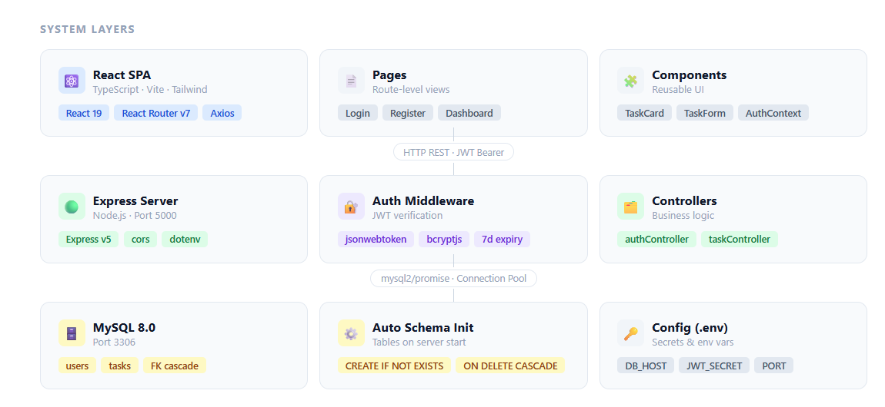
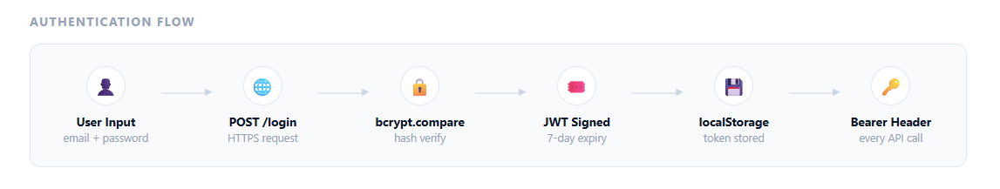
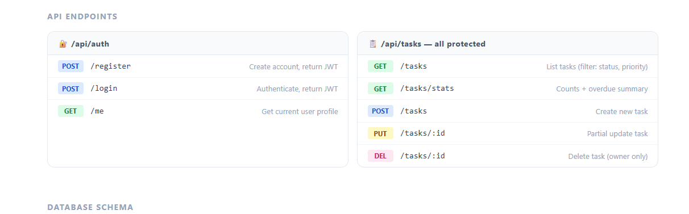
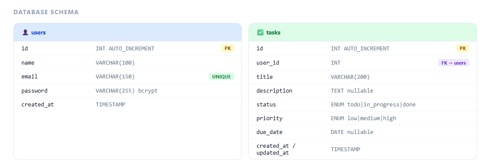

# TaskFlow

A full-stack task management application built with React, Node.js, and MySQL. Users can register, log in, and manage their personal tasks with support for priorities, due dates, and status tracking.

---

## Table of Contents

- [Features](#features)
- [Tech Stack](#tech-stack)
- [Architecture](#architecture)
- [Getting Started](#getting-started)
- [Environment Variables](#environment-variables)
- [API Reference](#api-reference)
- [Database Schema](#database-schema)
- [Project Structure](#project-structure)

---

## Features

- User registration and login with JWT-based authentication
- Create, edit, and delete tasks
- Set task priority (low, medium, high) and status (to do, in progress, done)
- Optional due dates with overdue indicators
- Dashboard with live task statistics including total tasks, in progress, completed, high priority, and overdue counts
- Filter tasks by status
- Fully responsive UI built with Tailwind CSS
- Toast notifications for all user actions

---

## Tech Stack

**Frontend**

| Tool | Version |
|---|---|
| React | 19.2.7 |
| TypeScript | 6.0.2 |
| Vite | 8.1.0 |
| Tailwind CSS | 3.4.19 |
| React Router | 7.18.0 |
| Axios | 1.18.1 |
| react-hot-toast | 2.6.0 |

**Backend**

| Tool | Version |
|---|---|
| Node.js | 18+ |
| Express | 5.2.1 |
| mysql2 | 3.22.5 |
| jsonwebtoken | 9.0.3 |
| bcryptjs | 3.0.3 |
| nodemon | 3.1.14 |

**Database**

- MySQL 8.0

---

## Architecture

The application follows a standard three-tier architecture. The React frontend talks to an Express REST API over HTTP using JWT Bearer tokens for authentication. The API connects to a MySQL database through a connection pool. Tables are created automatically when the server starts if they do not already exist.

**System Layers**



**Authentication Flow**



**API Endpoints**



**Database Schema**



---

## Getting Started

### Prerequisites

- Node.js 18 or higher
- MySQL 8.0 running locally
- A database named `taskflow` created in MySQL

### 1. Clone the repository

```bash
git clone https://github.com/vishwasfulda/taskflow.git
cd taskflow
```

### 2. Set up the backend

```bash
cd backend
npm install
```

Create a `.env` file inside the `backend` folder (see [Environment Variables](#environment-variables) below), then start the server:

```bash
npm run dev
```

The server will start on `http://localhost:5000`. Database tables are created automatically on first run.

### 3. Set up the frontend

Open a new terminal:

```bash
cd frontend
npm install
npm run dev
```

The app will be available at `http://localhost:5173`.

---

## Environment Variables

Create a file at `backend/.env` with the following values:

```env
PORT=5000

DB_HOST=localhost
DB_PORT=3306
DB_USER=root
DB_PASSWORD=your_mysql_password
DB_NAME=taskflow

JWT_SECRET=your_secret_key_here
JWT_EXPIRES_IN=7d
```

For the frontend, if you need to point to a different API URL in production, create `frontend/.env.production`:

```env
VITE_API_URL=https://your-api-domain.com/api
```

In development the frontend defaults to `http://localhost:5000/api` automatically.

---

## API Reference

All task routes require an `Authorization: Bearer <token>` header.

### Auth

| Method | Endpoint | Auth | Description |
|---|---|---|---|
| POST | `/api/auth/register` | No | Register a new user, returns JWT |
| POST | `/api/auth/login` | No | Log in, returns JWT |
| GET | `/api/auth/me` | Yes | Get the current user's profile |

### Tasks

| Method | Endpoint | Auth | Description |
|---|---|---|---|
| GET | `/api/tasks` | Yes | List all tasks, supports `?status=` and `?priority=` filters |
| GET | `/api/tasks/stats` | Yes | Get task counts including overdue |
| GET | `/api/tasks/:id` | Yes | Get a single task by ID |
| POST | `/api/tasks` | Yes | Create a new task |
| PUT | `/api/tasks/:id` | Yes | Update task fields (partial updates accepted) |
| DELETE | `/api/tasks/:id` | Yes | Delete a task (owner only) |

### Health Check

| Method | Endpoint | Auth | Description |
|---|---|---|---|
| GET | `/api/health` | No | Returns server status |

---

## Database Schema

The database uses two tables. Tables are created on server startup using `CREATE TABLE IF NOT EXISTS`, so no manual migration step is needed.

**users**

```sql
CREATE TABLE users (
  id         INT AUTO_INCREMENT PRIMARY KEY,
  name       VARCHAR(100) NOT NULL,
  email      VARCHAR(150) NOT NULL UNIQUE,
  password   VARCHAR(255) NOT NULL,       -- bcrypt hashed, salt rounds 12
  created_at TIMESTAMP DEFAULT CURRENT_TIMESTAMP
);
```

**tasks**

```sql
CREATE TABLE tasks (
  id          INT AUTO_INCREMENT PRIMARY KEY,
  user_id     INT NOT NULL,
  title       VARCHAR(200) NOT NULL,
  description TEXT,
  status      ENUM('todo', 'in_progress', 'done') DEFAULT 'todo',
  priority    ENUM('low', 'medium', 'high') DEFAULT 'medium',
  due_date    DATE,
  created_at  TIMESTAMP DEFAULT CURRENT_TIMESTAMP,
  updated_at  TIMESTAMP DEFAULT CURRENT_TIMESTAMP ON UPDATE CURRENT_TIMESTAMP,
  FOREIGN KEY (user_id) REFERENCES users(id) ON DELETE CASCADE
);
```

---

## Project Structure

```
taskflow/
├── backend/
│   └── src/
│       ├── config/
│       │   └── db.js               # MySQL connection pool and schema init
│       ├── controllers/
│       │   ├── authController.js   # Register, login, getMe
│       │   └── taskController.js   # CRUD and stats
│       ├── middleware/
│       │   └── auth.js             # JWT verification middleware
│       ├── routes/
│       │   ├── auth.js             # /api/auth routes
│       │   └── tasks.js            # /api/tasks routes
│       └── index.js                # Express app entry point
│
└── frontend/
    └── src/
        ├── api/
        │   └── client.ts           # Axios instance with JWT interceptors
        ├── components/
        │   ├── TaskCard.tsx
        │   └── TaskForm.tsx
        ├── context/
        │   └── AuthContext.tsx     # Global auth state
        ├── pages/
        │   ├── Login.tsx
        │   ├── Register.tsx
        │   └── Dashboard.tsx
        ├── types/
        │   └── index.ts            # TypeScript interfaces
        └── App.tsx                 # Router and route guards
```

---

## License

MIT
